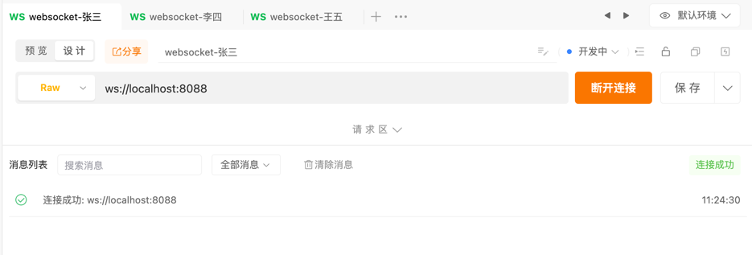
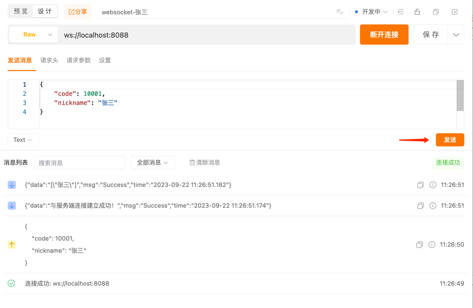
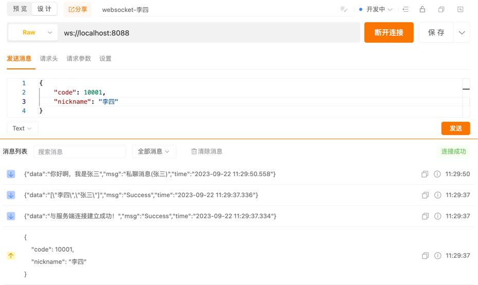

使用apiPost新建websocket连接测试


#### 1、建立连接
```json
{
    "code": 10001,
    "nickname": "张三"
}
```


#### 2、单聊
```json
{
    "code": 10002,
    "nickname": "张三",
    "target":"李四",
    "content": "你好啊，我是张三",
    "type": 1
}
```
张三发送消息，李四收到消息


#### 3、加入群聊组
```json
{
    "code": 10003,
    "nickname": "张三"
}
```
#### 4、发送群消息
```json
{
    "code": 10002,
    "nickname": "张三",
    "content": "大家好啊，我是张三",
    "type": 2
}
```
